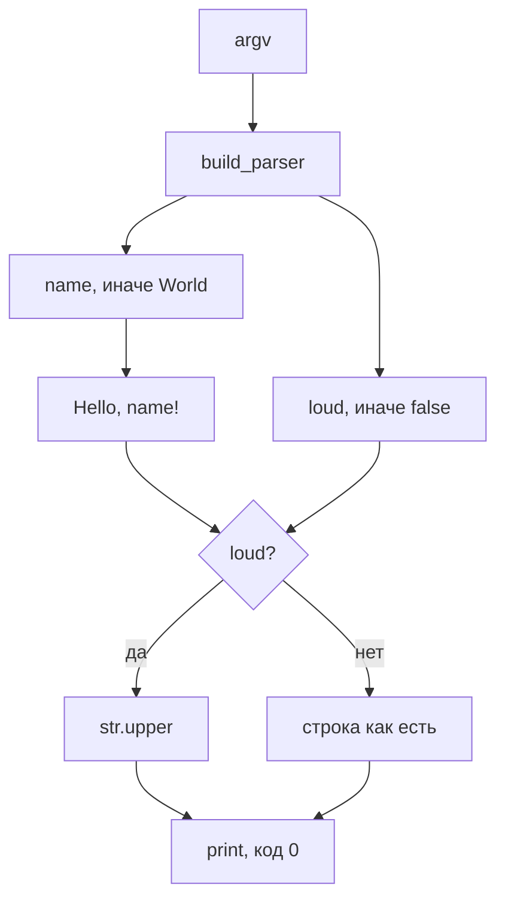
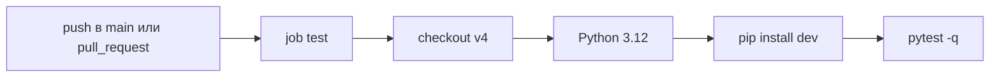

# hello

**hello** печатает одну строку приветствия и возвращает код `0`. Пакет — `hello-cli` версии `0.1.0` ([pyproject.toml](pyproject.toml), [`__version__`](src/hello_cli/__init__.py)). Скрипт консоли: `hello` → `hello_cli.cli:main`.

<p align="center">
  <a href="https://github.com/vladdd183/pilot-hello-cli/actions/workflows/ci.yml"></a>
  
  
</p>

> [!IMPORTANT]
> Файла лицензии в репозитории нет. Шага публикации пакета тоже нет: ставьте из клона.

## Содержание

- [Установка](#установка)
- [Команды](#команды)
- [Флаги](#флаги)
- [Как собирается строка](#как-собирается-строка)
- [Тесты](#тесты)
- [CI](#ci)
- [Каталог](#каталог)

## Установка

Нужен Python `>=3.12`. В CI стоит ровно `3.12`.

```bash
pip install -e ".[dev]"
```

У команды нет сторонних зависимостей: `cli.py` импортирует только `argparse`. Дополнительно `dev` тянет `pytest>=8` и `pytest-cov>=5`. Сборка — `setuptools>=68`.

Тесты вызывают исполняемый файл `hello` (не модуль). После установки он должен быть на `PATH` — так же, как в CI.

На PyPI этот репозиторий ничего не выкладывает. Имя `pip install hello-cli` к нему не относится.

## Команды

Так отвечает установленный `hello` `0.1.0`:

| Команда | stdout | код |
| --- | --- | --- |
| `hello` | `Hello, World!` | 0 |
| `hello --name Alice` | `Hello, Alice!` | 0 |
| `hello --name Bob --loud` | `HELLO, BOB!` | 0 |
| `hello --help` | справка argparse | 0 |

```text
$ hello
Hello, World!

$ hello --name Alice
Hello, Alice!

$ hello --name Bob --loud
HELLO, BOB!
```

```text
$ hello --help
usage: hello [-h] [--name NAME] [--loud]

Print a greeting.

options:
  -h, --help   show this help message and exit
  --name NAME  Name to greet
  --loud       Print the greeting in uppercase
```

## Флаги

Текст справки задан в [`build_parser`](src/hello_cli/cli.py).

| Флаг | По умолчанию | Что делает |
| --- | --- | --- |
| `--name NAME` | `World` | подставляет имя в строку |
| `--loud` | выключен | переводит всю строку в верхний регистр |
| `-h`, `--help` | — | печатает справку и выходит с кодом 0 |

`--loud` меняет уже собранную строку целиком: `Hello, Bob!` становится `HELLO, BOB!`, а не только имя.

## Как собирается строка

[`greeting`](src/hello_cli/cli.py) собирает `Hello, {name}!`. Если `loud` истинно, вызывает `str.upper()` и эту строку печатает `main`.



## Тесты

[tests/test_cli.py](tests/test_cli.py) — три вызова `hello` через `subprocess`. Запуск: `pytest -q`.

| Тест | Команда | stdout |
| --- | --- | --- |
| `test_hello_no_flags` | `hello` | `Hello, World!` |
| `test_hello_name_alice` | `hello --name Alice` | `Hello, Alice!` |
| `test_hello_name_bob_loud` | `hello --name Bob --loud` | `HELLO, BOB!` |

В тесте сравнивается и перевод строки в конце (`"Hello, World!\n"` и аналоги).

## CI

Файл [`.github/workflows/ci.yml`](.github/workflows/ci.yml), имя workflow — `ci`.

| | |
| --- | --- |
| когда | `push` в `main` и любой `pull_request` |
| раннер | `ubuntu-latest` |
| Python | `3.12` (`actions/setup-python@v5`) |
| checkout | `actions/checkout@v4` |
| установка | `pip install -e ".[dev]"` |
| проверка | `pytest -q` |



Точная команда установки — `pip install -e ".[dev]"`, в таблице выше. В схеме написано короче: `pip install dev`.

## Каталог

| Путь | Роль |
| --- | --- |
| [src/hello_cli/cli.py](src/hello_cli/cli.py) | разбор аргументов, строка, `main` |
| [src/hello_cli/__init__.py](src/hello_cli/__init__.py) | `__version__ = "0.1.0"` |
| [tests/test_cli.py](tests/test_cli.py) | три теста консольного скрипта |
| [pyproject.toml](pyproject.toml) | имя, версия, скрипт `hello`, pytest |
| [.github/workflows/ci.yml](.github/workflows/ci.yml) | CI |
| [docs/intent.md](docs/intent.md) | формулировка задачи, CLI её не читает |
| `specs/` | заметки рядом с кодом, CLI их не импортирует |

